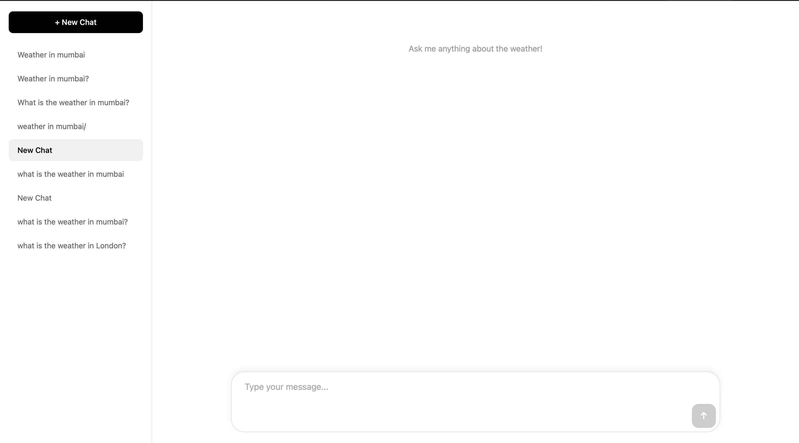
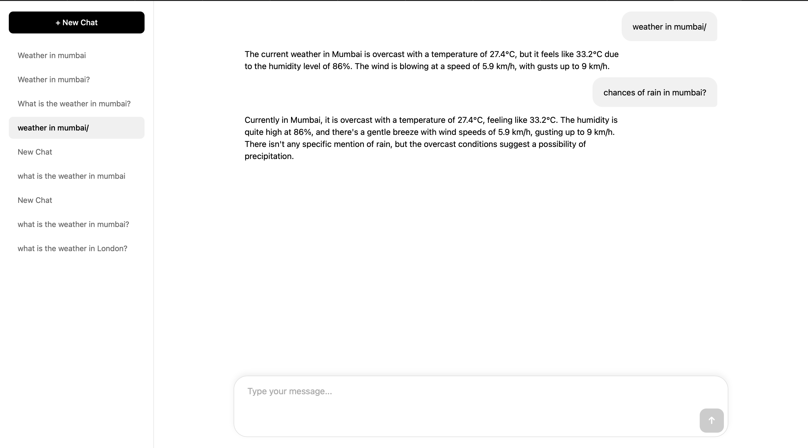

# Weather Chat

*A smart weather agent with memory that delivers real-time weather updates and remembers previous conversations.*


# 🌤️ Weather Chat – Interactive Weather Agent with Memory

This project is a **React + Vite** web app that connects to a custom **Weather Agent** (built in Mastra) to provide real-time weather updates.  
It remembers previous interactions, so you can have an ongoing conversation about the weather.

---

## 🚀 Features
- **Live Weather Data** – Fetches up-to-date weather info using Mastra deployment.
- **Chat Interface** – Simple, intuitive chat layout for user queries.
- **Agent Memory** – Remembers past conversation context.
- **No API Key Required** – Works via configured Mastra agent endpoint.
- **Responsive UI** – Works on desktop & mobile.

---

## 📸 Screenshots

### Main Chat UI


### Weather Agent in Action


---

## 🛠️ Tech Stack
- **Frontend:** React + Vite
- **Styling:** CSS (custom + index.css)
- **Backend Agent:** Mastra Weather Agent
- **Build Tool:** Vite

---

## 📂 Project Structure
my-project/
│
├── public/
├── screenshots/       # Project screenshots
├── src/
│   ├── assets/
│   ├── components/    # ChatWindow, Sidebar
│   ├── utils/         # API functions
│   ├── App.jsx
│   ├── index.css
│   └── main.jsx
├── index.html
├── package.json
└── README.md

---

## ⚙️ Setup & Run Locally
```bash
# Clone the repo
git clone https://github.com/vinitvajani/weather-chat.git

# Go to project folder
cd weather-chat

# Install dependencies
npm install

# Start the development server
npm run dev

📬 How It Works
	1.	User enters a weather query in the chat box.
	2.	Mastra Weather Agent processes the request and fetches weather info.
	3.	Agent responds in real time via streaming API.
	4.	Chat interface updates instantly.

⸻

👨‍💻 Author

Vinit Vajani – GitHub

⸻

⭐ Like this project?

If you find this project useful, consider giving it a star ⭐ on GitHub to support my work!


